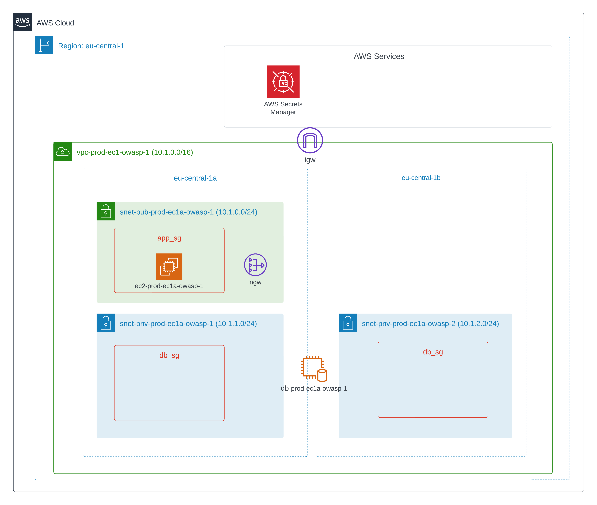

[](https://github.com/leticiavalladares/iac-iast-owasp-demo/actions/workflows/deploy-infra.yml) 
# IAST demo using OpenTelemetry

### Description 
IaC for IAST of OWASP Juice Shop app. 
### Architecture 
 
### Local deployment 
#### Requirements 
- AWS CLI 
- Git 
- Terraform 
#### Resources created on the AWS Management Console 
- tfstate S3 bucket with DynamoDB  
- Secrets in AWS Secrets Manager to store database user and password 
-  
#### Requirements before deploying locally 
- Add local machine IP address as a variable in your environement  
#### Requirements before deploying through GitHub Actions 
- Add local machine IP address as a GitHub Secret in your repository 
#### Steps for Unix systems 
 1. Connect to your AWS account with short-term credentials from AWS IAM<br>
 `aws configure` 
 
```
AWS Access Key ID [None]: <YOUR_ACCESS_KEY>
AWS Secret Access Key [None]: <YOUR_SECRET_ACCESS_KEY>
Default region name [None]: <REGION>
Default output format [None]: <PREFERRED_FORMAT_SUCH_AS_JSON>
``` 
 
 2. Clone this repository in your local machine <br>
 `git clone <HTTPS/SSH>` 
 
 3. Go to the repository folder <br>
 `cd iac-iast-owasp-demo` 
 
 4. Go to infrastructure folder <br>
 `cd infrastructure` 
 
 5. Initialize terraform <br>
 `terraform init` 
 
 6. Run terraform plan <br>
 `terraform plan` 
 
 7. Deploy resources in AWS <br>
 `terraform apply` 

<!-- BEGIN_TF_DOCS -->
### Requirements

No requirements.

### Providers

| Name | Version |
|------|---------|
| <a name="provider_aws"></a> [aws](#provider\_aws) | 5.11.0 |

### Modules

No modules.

### Resources

| Name | Type |
|------|------|
| [aws_db_instance.rds](https://registry.terraform.io/providers/hashicorp/aws/latest/docs/resources/db_instance) | resource |
| [aws_db_subnet_group.db_sg](https://registry.terraform.io/providers/hashicorp/aws/latest/docs/resources/db_subnet_group) | resource |
| [aws_eip.nat_eip](https://registry.terraform.io/providers/hashicorp/aws/latest/docs/resources/eip) | resource |
| [aws_iam_instance_profile.instance_profile](https://registry.terraform.io/providers/hashicorp/aws/latest/docs/resources/iam_instance_profile) | resource |
| [aws_iam_openid_connect_provider.default](https://registry.terraform.io/providers/hashicorp/aws/latest/docs/resources/iam_openid_connect_provider) | resource |
| [aws_iam_role.github_actions](https://registry.terraform.io/providers/hashicorp/aws/latest/docs/resources/iam_role) | resource |
| [aws_iam_role.instance_role](https://registry.terraform.io/providers/hashicorp/aws/latest/docs/resources/iam_role) | resource |
| [aws_iam_role_policy_attachment.github_actions_atch](https://registry.terraform.io/providers/hashicorp/aws/latest/docs/resources/iam_role_policy_attachment) | resource |
| [aws_iam_role_policy_attachment.ssm_policy](https://registry.terraform.io/providers/hashicorp/aws/latest/docs/resources/iam_role_policy_attachment) | resource |
| [aws_instance.app_server](https://registry.terraform.io/providers/hashicorp/aws/latest/docs/resources/instance) | resource |
| [aws_internet_gateway.ig_external_vpc](https://registry.terraform.io/providers/hashicorp/aws/latest/docs/resources/internet_gateway) | resource |
| [aws_main_route_table_association.rtb_assoc](https://registry.terraform.io/providers/hashicorp/aws/latest/docs/resources/main_route_table_association) | resource |
| [aws_nat_gateway.nat_external_vpc](https://registry.terraform.io/providers/hashicorp/aws/latest/docs/resources/nat_gateway) | resource |
| [aws_route_table.rtb](https://registry.terraform.io/providers/hashicorp/aws/latest/docs/resources/route_table) | resource |
| [aws_security_group.sg](https://registry.terraform.io/providers/hashicorp/aws/latest/docs/resources/security_group) | resource |
| [aws_ssm_activation.ssm_activation](https://registry.terraform.io/providers/hashicorp/aws/latest/docs/resources/ssm_activation) | resource |
| [aws_subnet.subnet](https://registry.terraform.io/providers/hashicorp/aws/latest/docs/resources/subnet) | resource |
| [aws_vpc.vpc](https://registry.terraform.io/providers/hashicorp/aws/latest/docs/resources/vpc) | resource |
| [aws_ami.ubuntu_image](https://registry.terraform.io/providers/hashicorp/aws/latest/docs/data-sources/ami) | data source |
| [aws_iam_policy_document.assume_role](https://registry.terraform.io/providers/hashicorp/aws/latest/docs/data-sources/iam_policy_document) | data source |
| [aws_iam_policy_document.github_assume_role_policy](https://registry.terraform.io/providers/hashicorp/aws/latest/docs/data-sources/iam_policy_document) | data source |
| [aws_region.current_region](https://registry.terraform.io/providers/hashicorp/aws/latest/docs/data-sources/region) | data source |
| [aws_secretsmanager_secret.db_secret](https://registry.terraform.io/providers/hashicorp/aws/latest/docs/data-sources/secretsmanager_secret) | data source |
| [aws_secretsmanager_secret_version.db_secrets](https://registry.terraform.io/providers/hashicorp/aws/latest/docs/data-sources/secretsmanager_secret_version) | data source |

### Inputs

| Name | Description | Type | Default | Required |
|------|-------------|------|---------|:--------:|
| <a name="input_my_ip"></a> [my\_ip](#input\_my\_ip) | IP for ssh | `any` | n/a | yes |

### Outputs

No outputs.
<!-- END_TF_DOCS -->
### Five last commits
8333606 - Ignore push of some file when running the pipeline<br>
8bc788b - Ignore push of some file when running the pipeline<br>
280ff4c - Add TF_VAR_my_ip env var to pipeline<br>
d4c00de - Add my_ip env var to pipeline<br>
fc6e417 - Add terraform apply and correct plan in pipeline<br>

### README Activity Log
This README file was updated on Tue Aug  8 18:24:29 CEST 2023 by Leticia Valladares on this [commit](https://github.com/leticiavalladares/iac-iast-owasp-demo/commit/83336060317fa2b268e25808f2866ca7d40891e6)
